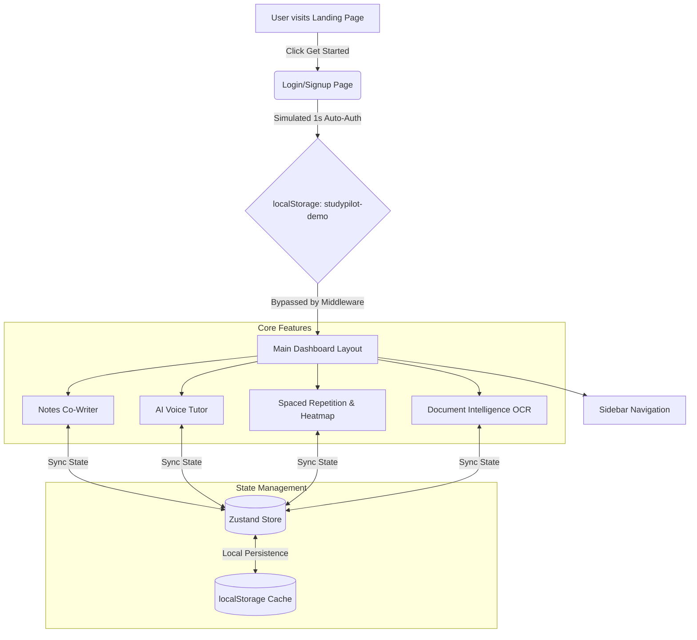
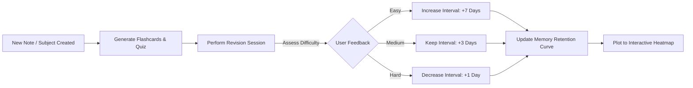

# <p align="center">✦ StudyPilot AI ✦</p>
<p align="center">
  <strong>Your Ultimate AI-Powered Academic Companion & Study Workspace</strong>
</p>

<p align="center">
  
  
  
  
  
</p>

---

## 🌟 Introduction

**StudyPilot AI** is a state-of-the-art, recruiter-ready educational productivity suite designed to replace generic flashcard tools, calendar programs, and standalone chat widgets. It unifies note-taking, calendar scheduling, flashcards, mock testing, analytics, speech synthesis, and coding terminals into a cohesive, glassmorphic client-side workspace.

This repository features a **Zero-Auth Demo Pipeline** so anyone can instantly test all features without sign-up forms, subscription walls, or API keys.

---

## 🚀 Interactive Workflows

### 1. Application Architecture Flow
Here is how StudyPilot AI manages its frontend routing, Zustand local state, and mock auth engine:



---

### 2. Spaced Repetition & Revision Loop
The core revision engine tracks forgetting curves and schedules tasks dynamically:



---

## 🛠️ Feature Breakdown

### 🧠 Smart Revision Engine
* **Spaced Repetition Queue**: Sorts topics by urgency level (Overdue, Due Today, Tomorrow, Later).
* **Forgetting Curve Simulation**: Interactive LineChart showing memory retention over time with and without revision.
* **Revision Heatmap**: A custom 24-week grid heatmap visualization tracking daily study streaks.

### 🎙️ AI Voice Tutor
* **Pedagogical Modes**: Focus on different outputs:
  * 👨‍🏫 **Teacher Mode**: Detailed professor-style explanations.
  * 👶 **Beginner Mode**: Analogies and simple terms.
  * 📚 **Exam Mode**: Fast revision bullet points.
  * 🎯 **Interview Mode**: Interactive Q&A loop.
* **Voice Synthesis & Visualizer**: Interactive audio player with custom animated SVG sound waveforms.

### 📂 Advanced Document Intelligence
* **OCR Handwritten Notes**: Mock drop zone to digitize hand-written text.
* **Multi-Format Citation Engine**: Instant citation generation in **APA, MLA, and Chicago** formats.
* **Document Explorer**: Tabs for automatic Paper Summaries, Key Insights, Mind Maps, and custom flashcards.

### 🎥 Lecture Intelligence
* **Lecture Voice uploads**: Drag and drop audio or paste **YouTube links** to transcribe and summarize lectures.
* **Timeline Tracker**: Automated notes with timestamp references.

### 💻 Developer Workspace
* **Integrated Coding Terminal**: Select LeetCode topics, code in a monospace mockup editor, and run simulated test suites.
* **CGPA Tracker**: Grade predictor with interactive SGPA calculation tables per semester.
* **Kanban Task Board**: Categorize to-do items, track subtasks, and manage priorities.

---

## 📂 Project Structure

```text
studypilotai/
├── public/                 # Static assets and icons
└── src/
    ├── app/                # Next.js 15 App Router pages
    │   ├── (auth)/         # Guest-delay signup and login pages
    │   │   ├── login/
    │   │   └── signup/
    │   ├── (dashboard)/    # Main dashboard features
    │   │   ├── ai-tutor/
    │   │   ├── analytics/
    │   │   ├── bookmarks/
    │   │   ├── career/
    │   │   ├── cgpa/
    │   │   ├── coding/
    │   │   ├── dashboard/
    │   │   ├── exam-hub/
    │   │   ├── flashcards/
    │   │   ├── gamification/
    │   │   ├── lecture-ai/
    │   │   ├── notes/
    │   │   ├── pdf-ai/
    │   │   ├── planner/
    │   │   ├── pomodoro/
    │   │   ├── quiz/
    │   │   ├── revision/
    │   │   ├── settings/
    │   │   ├── social/
    │   │   ├── tasks/
    │   │   ├── voice-tutor/
    │   │   └── whiteboard/
    │   ├── globals.css     # CSS custom variables & glassmorphism
    │   ├── layout.tsx      # Root layout
    │   ├── loading.tsx     # Global skeleton loader screen
    │   ├── not-found.tsx   # Custom 404 page
    │   └── page.tsx        # Dynamic landing page
    ├── components/         # Global widgets
    │   ├── brand-icons.tsx # Custom SVGs (Google, GitHub, X, etc.)
    │   ├── command-palette.tsx
    │   ├── notifications-panel.tsx
    │   └── providers.tsx
    ├── lib/                # Shared utilities & stores
    │   ├── demo-session.ts # Session persistence helpers
    │   ├── mock-session.ts # Mock user credentials
    │   ├── store.ts        # Zustand state stores
    │   └── utils.ts        # Dynamic className merges
    └── types/              # TypeScript interface schemas
```

---

## ⚡ Setup & Run Locally

### Prerequisites
* **Node.js** v18+ 
* **npm** or **yarn**

### 1. Clone & Install
```bash
git clone https://github.com/Rishisharma029/StudypilotAI.git
cd StudypilotAI
npm install
```

### 2. Run Development Server
```bash
npm run dev
```
Open **[http://localhost:3000](http://localhost:3000)** in your browser.

### 3. Production Build
Ensure code compiles cleanly with all typechecks:
```bash
npm run build
```

---

## 🔒 Guest Demo Credentials

The login process is simulated locally to bypass server authentication:
* **Demo Account**: `demo@studypilot.ai`
* **Default Username**: `Rishi Sharma`
* **Default Streak**: `12 days`
* **Streak Multiplier**: `Silver Tier Level`
